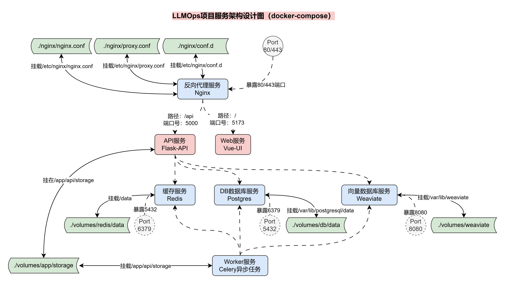

# VlexLLMOps — AI / Agent 应用开发平台

VlexLLMOps 是一个面向企业级交付的 LLMOps 平台，帮助开发者通过可视化方式快速搭建、部署与管理 AI Agent 应用：通过对话式、低代码的配置即可完成智能体、工作流、知识库的构建，显著缩短大模型应用从想法到上线的交付周期。

## ✨ 平台特性

- **Agent 编排（LangGraph）**：以状态图为核心编排，模型 / 工具 / RAG / 记忆四要素节点插件化，业务按需组装，像"搭积木"一样灵活；Agent 决策过程通过 SSE 实时可见
- **双轨工具体系**：内置工具（开箱即用、全局共享）+ 基于 OpenAPI / MCP 协议的自定义工具（适配私有化需求），统一注册、鉴权与调用闭环
- **RAG 知识库**：文档异步索引、混合检索（关键词 + 向量）、恶意文档拦截，降低大模型幻觉与知识时效性问题；支持 GraphRAG 增强实体关系问答
- **长短时记忆**：短记忆 Token / 轮次双维裁剪 + 摘要压缩，长记忆实体落库 + 向量化双通道，多轮上下文可控、跨会话可唤醒
- **运维可观测**：Token 消耗、节点耗时、成本核算的监控闭环，迭代优化有据可依
- **开放 API**：面向开发者的 OpenAPI 服务，快速集成到业务系统

## 🏗️ 系统架构

七层架构：表示层、接入层、控制层、服务层、核心层、存储层、资源层。



## 🧰 技术栈

Python · Flask · SQLAlchemy · PostgreSQL · Redis · Celery · Weaviate · LangChain · LangGraph · OpenAI Embeddings · jieba · Unstructured · MCP / FastMCP · JWT · 腾讯云 COS · Vue 3 · Vite · Nginx · Docker

## 📁 目录结构

```
├── api/                 # 后端服务（Flask 单体应用，含迁移、服务、任务）
├── ui/                  # 前端（Vue 3 + Vite + Tailwind）
├── docker/              # Docker Compose 编排与部署配置
│   ├── docker-compose.yaml
│   ├── nginx/           # 反向代理配置
│   ├── postgres/        # 数据库初始化脚本
│   └── .env.example     # 环境变量模板（部署必填）
```

## 🚀 快速开始

```bash
cd docker

# 1. 配置环境变量（密钥类全部通过环境变量注入）
cp .env.example .env

# 2. 启动全部服务（ui / api / celery / postgres / redis / weaviate / nginx）
docker-compose up -d

# 3. 访问平台
#    http://localhost   （nginx 入口）
```

> 详细的环境变量清单见 [docker/.env.example](docker/.env.example)。生产部署前请务必修改 `JWT_SECRET_KEY`、各 `API_KEY` 与数据库密码。

## 📚 文档

- 接口文档：`api/docs/`（含 Postman 请求结构）
- API 鉴权：平台 OpenAPI 服务提供 `access_token`（密码登录 / OAuth）

## 📄 License

内部项目，代码仅供学习参考。
